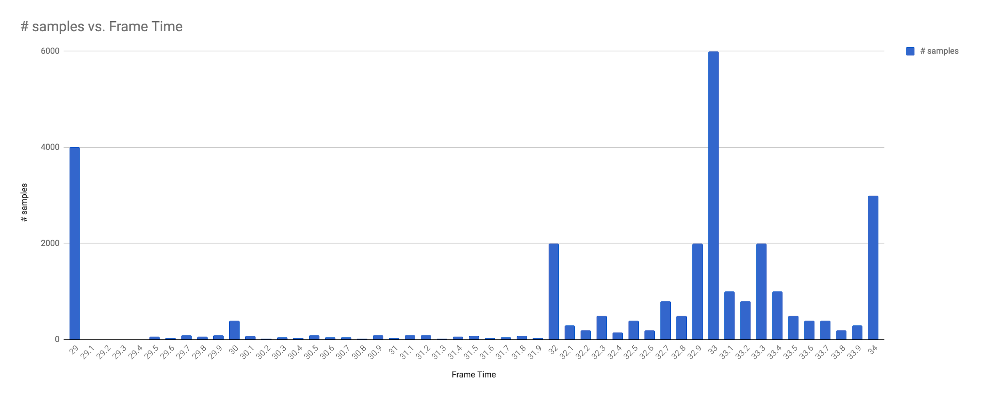

# Tuning Fork Game Engine Integration Guide

Instructions on how to integrate Tuning Fork into a game or game engine running on Android.

| | |
|-|-|
| Author | willosborn@google.com |
| Contributors | idries-team@google.com |
| Intended audience | Android Game Engineers |
| Status | WIP |
| Created | 2019-12-05 |
| Self-link | [go/tuningfork-integration-guide](go/tuningfork-integration-guide) |

<!-- vscode-markdown-toc -->
* 1. [Introduction](#Introduction)
	* 1.1. [How does Tuning Fork record and upload data?](#HowdoesTuningForkrecordanduploaddata)
	* 1.2. [What is an Instrument Key?](#WhatisanInstrumentKey)
	* 1.3. [What are Annotations?](#WhatareAnnotations)
	* 1.4. [What are Fidelity Parameters?](#WhatareFidelityParameters)
	* 1.5. [What memory and CPU overhead is there?](#WhatmemoryandCPUoverheadisthere)
* 2. [Integrating the Games SDK into your build](#IntegratingtheGamesSDKintoyourbuild)
	* 2.1. [Swappy Integration](#SwappyIntegration)
* 3. [Integrating Tuning Fork into your code](#IntegratingTuningForkintoyourcode)
* 4. [Defining Annotations and Fidelity Parameters in dev_tuningfork.proto](#DefiningAnnotationsandFidelityParametersindev_tuningfork.proto)
* 5. [Defining Settings in tuningfork_settings.txt](#DefiningSettingsintuningfork_settings.txt)
	* 5.1. [Loading Annotations](#LoadingAnnotations)
* 6. [Defining Fidelity Parameter Sets / Quality Levels](#DefiningFidelityParameterSetsQualityLevels)
* 7. [Web Requests](#WebRequests)
	* 7.1. [What happens when the player is offline?](#Whathappenswhentheplayerisoffline)
* 8. [Packaging your APK](#PackagingyourAPK)
* 9. [Validation](#Validation)
* 10. [Protocol buffers](#Protocolbuffers)
	* 10.1. [Proto2 vs proto3](#Proto2vsproto3)
	* 10.2. [Text vs binary representations](#Textvsbinaryrepresentations)
	* 10.3. [Full vs Lite vs Nano](#FullvsLitevsNano)
* 11. [Tuning Fork API Overview](#TuningForkAPIOverview)
	* 11.1. [Lifecycle Functions](#LifecycleFunctions)
	* 11.2. [Per-Frame Functions](#Per-FrameFunctions)
	* 11.3. [Annotations](#Annotations)
	* 11.4. [Accessing Files in the APK](#AccessingFilesintheAPK)
	* 11.5. [Download Fidelity Parameters on a separate thread](#DownloadFidelityParametersonaseparatethread)
	* 11.6. [Saving and deleting fidelity parameters stored on device](#Savinganddeletingfidelityparametersstoredondevice)
* 12. [Notes](#Notes)

<!-- vscode-markdown-toc-config
	numbering=true
	autoSave=true
	/vscode-markdown-toc-config -->
<!-- /vscode-markdown-toc -->

---

##  1. <a name='Introduction'></a>Introduction

Tuning Fork is a support library developed by the Android Platform team that records live frame timing information, aggregates it, and uploads it for viewing and analysis within the Play console. The timing information is recorded as histograms.

Using this information gathered ‘in the wild’, you can tune a set of ‘[fidelity parameters](#WhatareFidelityParameters)’ for a particular device or device family.

Tuning Fork has two modes, scaled and expert. In scaled mode, you upload data to Play and the Play backend analyzes the data in order to produce recommendations for changes to the game's quality settings. In expert mode, you define experiments that are run across the population of devices and remotely configure the quality settings of your game.

###  1.1. <a name='HowdoesTuningForkrecordanduploaddata'></a>How does Tuning Fork record and upload data?

Tuning Fork relies on one of its [‘tick’](#LifecycleFunctions) functions being called each frame either by the [Android Frame Pacing Library](https://developer.android.com/games/sdk/frame-pacing) or the game.
Within the library, this tick information is aggregated into histograms which are then periodically uploaded to Play through an HTTP endpoint.



Each tick is recorded as being associated with an instrument key and an annotation, the definitions for which you specify in a protocol buffer file.

###  1.2. <a name='WhatisanInstrumentKey'></a>What is an Instrument Key?

An instrument key indicates where in the frame the tick comes from, e.g. frame start, GPU fence, or a trace for a particular function call. The instrument key is an integer that must be passed to each tick function call. The game must specify the maximum number of valid instrument keys at initialization. Keys 64000 and higher are reserved for Google-defined ticks.

###  1.3. <a name='WhatareAnnotations'></a>What are Annotations?

An annotation gives contextual information about what your game is doing when the tick is recorded, e.g. which level is current, whether a scene is loading, or any other relevant state. An annotation can be freely specified by extending the `com.google.tuningfork.Annotation` protocol buffer message, although fields are restricted to enums. In order to set the current annotation, you pass a serialization of the message you have defined to `TuningFork_setCurrentAnnotation`. All subsequent tick data is associated with this annotation until another annotation is set.

An example annotation proto definition:

```
import "tuningfork.proto"
enum LoadingState {
  INVALID_LS = 0;
  LOADING = 1;
  NOT_LOADING = 2;
}
enum Level {
  INVALID_LEVEL = 0;
  Level_1 = 1;
  Level_2 = 2;
  Level_3 = 3;
}
message Annotation {
  optional LoadingState loading_state = 1;
  optional Level level = 2;
}
```

###  1.4. <a name='WhatareFidelityParameters'></a>What are Fidelity Parameters?

Fidelity Parameters are parameters you define that influence the performance and graphical fidelity of your game, such as mesh level-of-detail, texture resolution and antialiasing method. Each parameter must be of type `enum`, `float`, or `int32`. Like annotations, fidelity parameters are defined as a protocol buffer message called `FidelityParams`. At Tuning Fork initialization, you must pass a serialization of the default fidelity parameters, which will be associated with the tuning fork timing data if no successful download of fidelity parameters from Play is possible. However, if downloading is successful, you should deserialize the `FidelityParams` returned and use these for the current game session.

In order for Play to understand the Annotations and Fidelity Parameters that you define, the proto file holding their definitions must be bundled within the game’s APK, together with initialization settings, as detailed [below](#bookmark=id.hml4oxg411pt).


###  1.5. <a name='WhatmemoryandCPUoverheadisthere'></a>What memory and CPU overhead is there?

All memory that Tuning Fork uses is allocated up-front at initialization, in order to avoid surprises during gameplay. The size of the data depends on the number of instrument keys, number of possible annotations, and number of buckets in each histogram: it is a multiple of all these times 32 bits for each bucket. There are also two copies of all histograms in order to allow for submission in a double-buffered fashion.

Submission occurs on a separate thread, at a regular interval that you define in the initialization settings, and will not block tick calls. Note that upload to Play will occur at a later time, when GMSCore dictates.

Calls to the ‘tick’ functions calculate an index into the array of histogram buckets and increment an integer count, so are not heavyweight.

---

##  2. <a name='IntegratingtheGamesSDKintoyourbuild'></a>Integrating the Games SDK into your build


Tuning Fork is packaged as part of the Android Games SDK, which is available as a binary release of shared libraries, static libraries, headers and samples on [https://developer.android.com](https://developer.android.com).
The entire source is also available via the Android Open Source project [[gitiles](https://android.googlesource.com/platform/frameworks/opt/gamesdk/+/refs/heads/master/README.md)].

Full instructions for compiling and linking your game or game engine against the Games SDK are available on DAC.

It is recommended that you start by looking at and building the tftestapp sample. This uses CMake and shows how to use the gamesdk.cmake file, which is the easiest way to get started.
If you are not using CMake, you will need to:

*   Add &lt;gamesdk&gt;/include to your compiler include paths.
*   Add &lt;gamesdk&gt;/libs/&lt;build_version&gt; to your linker library path, where build_version is an concatenation of ABI, SDK version, NDK version, STL and build variant, e.g. arm64-v8a_API21_NDK19_cpp_static_Release. Look in &lt;gamesdk&gt;/libs and pick the one that best suits your toolchain or choose the latest.
*   Add -lgamesdk to your linker command line.
*   Add internet permissions to your AndroidManifest.xml file with the following line at the top level : \
  `  <uses-permission android:name="android.permission.INTERNET" />`


###  2.1. <a name='SwappyIntegration'></a>Swappy Integration

It is recommended that you integrate the [Swappy frame pacing library](https://developer.android.com/games/sdk/frame-pacing) before integrating Tuning Fork.
If you do this and pass in the Swappy_injectTracers function at Tuning Fork initialization, Tuning Fork can automatically record frame timing without you explicitly calling the tick functions yourself.

Tracers with the following instrument keys are added:

*   Frame start.
*   GPU fence (previous frame consumed by the display pipeline).
*   Trace of the time Swappy waited until the GPU fence.
*   Trace of the time taken by eglSwapBuffers.

---

##  3. <a name='IntegratingTuningForkintoyourcode'></a>Integrating Tuning Fork into your code

The core interface for Tuning Fork can be found `include/tuningfork/tuningfork.h`. There are also utility functions in `include/tuningfork/tuningfork_extra.h`.

Several functions take serializations of protocol buffers, which are Google’s language-neutral, structured, data-interchange format. For more on using protocol buffers within your game, see [below](#bookmark=id.hjg2eqhkp9l8).

Function parameters and return values are explained in the headers.

---

##  4. <a name='DefiningAnnotationsandFidelityParametersindev_tuningfork.proto'></a>Defining Annotations and Fidelity Parameters in dev_tuningfork.proto

Define the possible annotations and fidelity parameters for your game in a file called dev_tuningfork.proto. An example from the sample is:

```
syntax = "proto3";

package com.google.tuningfork;

enum LoadingState {
  LOADING_INVALID = 0;
  NOT_LOADING = 1;
  LOADING = 2;
}

enum Level {
  // 0 is not a valid value
  LEVEL_INVALID = 0;
  LEVEL_1 = 1;
  LEVEL_2 = 2;
  LEVEL_3 = 3;
};

message Annotation {
  LoadingState loading = 1;
  Level level = 2;
}

message FidelityParams {
  int32 num_spheres = 1;
  float tesselation_percent = 2;
}
```

* The package must be com.google.tuningfork.
* The message names must be exactly _Annotation_ and _FidelityParams_.
* Only enums defined in this file can be used as part of annotations.
* FidelityParams fields can only be enums, int32s or floats.
* The [validation tool](#Validation) enforces these conventions.

##  5. <a name='DefiningSettingsintuningfork_settings.txt'></a>Defining Settings in tuningfork_settings.txt

The settings protocol buffer message is defined as follows:


```
message Settings {
  message Histogram {
    optional int32 instrument_key = 1;
    optional float bucket_min = 2;
    optional float bucket_max = 3;
    optional int32 n_buckets = 4;
  }
  message AggregationStrategy {
    enum Submission {
      UNDEFINED = 0;
      TIME_BASED = 1;
      TICK_BASED = 2;
    }
    optional Submission method = 1;
    optional int32 intervalms_or_count = 2;
    optional int32 max_instrumentation_keys = 3;
    repeated int32 annotation_enum_size = 4;
  }
  optional AggregationStrategy aggregation_strategy = 1;
  repeated Histogram histograms = 2;

  // Base request URI.
  // If missing, https://performanceparameters.googleapis.com/v1/ is used.
  optional string base_uri = 3;

  // Google Play API key.
  // Requests may receive an error response if this is missing or wrong.
  optional string api_key = 4;

  // Name of the fidelitiy_parameters.bin file in assets/tuningfork
  //  used if no download was ever successful.
  optional string default_fidelity_parameters_filename = 5;

  // Timeout before first timeout of fidelity parameters request.
  // The request will then be repeated.
  optional int32 initial_request_timeout_ms = 6;

  // The time after which repeat requests are ceased.
  optional int32 ultimate_request_timeout_ms = 7;

  // Reserve 100-120 for indexes into the annotation array.
  optional int32 loading_annotation_index = 100; // 1-based index
  optional int32 level_annotation_index = 101; // 1-based index
}
```


The _aggregation_strategy_ field contains settings applicable to the whole library:

*   _method_ and _intervalms_or_count_ determine how often submission of collected data will be made. For a time-based strategy, at least _intervalms_or_count_ milliseconds will pass between submissions. For a tick-based strategy, submission will be attempted after _intervalms_or_count_ ticks are received for a given histogram. **It is recommended that you do not submit data less than every 5 minutes.**
*   _max_instrumentation_keys_ gives the number of instrument keys that can be expected to be used in tick functions.
*   _annotation_enum_size_ is information that can be obtained by running the `tuningfork_validator.py` script on the protobuf defining your Annotation message. It is an array of integers giving the maximum value + 1 that each enum in your annotation can take. It is named assuming that you will sequentially number your enum values from 1, which is most efficient in terms of memory allocated.

The _histograms_ field is an array of _Histogram_ messages detailing how information for each instrument key will be bucketed. Note that _n_buckets_ is the number of buckets between _bucket_min_ and _bucket_max_ and there will be 2 extra buckets allocated for values outside this range, above and below.
Any instrument keys that are not present in _histrograms_ will use default settings and for Tuning Fork Scaled you do not need to set any histograms.

You define your settings in tuningfork_settings.txt and serialize this to a proto bin file using the validation tool (see [below](#Validation)).

The URLs from which fidelity parameters are downloaded and to which telemetry is uploaded are constructed from `base_uri`, the app’s package name, the app’s version code and an API name. They are:


```
${base_uri}applications/${package_name}/apks/${version_code}:generateTuningParameters
${base_uri}applications/${package_name}/apks/${version_code}:uploadTelemetry
```

To connect to Google servers, _base_uri_ should be set to:


```
https://performanceparameters.googleapis.com/v1/
```


_api_key_ is used to validate your connection to the endpoint. It is obtained from the Play console when you set up your app. If you see connection errors in logcat, please check that the API key is correct and that you have been whitelisted by Play.

An example text representation is:

```
aggregation_strategy: {method: TIME_BASED, intervalms_or_count: 600000, max_instrumentation_keys: 2, annotation_enum_size: [2,4,3]}
histograms: [{instrument_key: 0, bucket_min: 28, bucket_max: 32, n_buckets: 70}, {instrument_key: 1, bucket_min: 28, bucket_max: 32, n_buckets: 70}]
base_uri: "https://performanceparameters.googleapis.com/v1/"
api_key: "get-me-from-play"
default_fidelity_parameters_filename: "dev_tuningfork_fidelityparams_3.bin"
initial_request_timeout_ms: 1000
ultimate_request_timeout_ms: 100000
loading_annotation_index: 1
level_annotation_index: 2
```

This will submit all non-empty histograms every 10 minutes. It has 2 instrument keys and ticks between 28ms and 32ms in duration will be collected for each histogram in 70 buckets, with 2 buckets for values outside this range. There are 3 enums in the Annotation message, the first can take 2 values, the second 4 and the third 3.

###  5.1. <a name='LoadingAnnotations'></a>Loading Annotations

If you set the _loading_annotation_index_ field in your settings, a special meaning is given to the
annotation with that index.
While the loading annotation is set to _LOADING_, frame ticks will be ignored. When the loading annotation is reset to _NOT_LOADING_ the time spent in _LOADING_ state is recorded in the histogram for that annotation.

In the above settings, since _loading_annotation_index_ is 1, the first annotation is taken to mean whether the game is loading the next scene or not.
Since _level_annotation_index_ is 2, the second annotation is taken to be the level number.

---

##  6. <a name='DefiningFidelityParameterSetsQualityLevels'></a>Defining Fidelity Parameter Sets / Quality Levels

##  7. <a name='WebRequests'></a>Web Requests

###  7.1. <a name='Whathappenswhentheplayerisoffline'></a>What happens when the player is offline?

##  8. <a name='PackagingyourAPK'></a>Packaging your APK

Your dev_tuningfork.proto file, tuningfork_settings.txt file and dev_tuningfork_fidelityparams.txt files should be placed in your APK assets folder under assets/tuningfork.

The latter are fidelity parameter sets that you can choose between in expert mode within the Play store interface.

---

##  9. <a name='Validation'></a>Validation

The validation tool is placed in the game sdk under **src/tuningfork/tools/validation.**

All details including how to run it are in the corresponding **README** file.

The validation will generate all binary *.bin files for you.

---

##  10. <a name='Protocolbuffers'></a>Protocol buffers

Tuning Fork uses Google’s protocol buffer format for settings, annotations and fidelity parameters. This is a well-defined, multi-language protocol for extensible, structured data https://developers.google.com/protocol-buffers/ but it does have some idiosyncrasies and things of which to be aware.


###  10.1. <a name='Proto2vsproto3'></a>Proto2 vs proto3

The version of the protocol buffer format is set in the first line of the file, e.g.


```
syntax="proto2";
```


These two commonly-used versions of protocol buffers use the same wire format but the definition files are not compatible. The main differences are that the optional and required keywords are no longer allowed in proto3: everything is effectively optional. Also, extensions are not supported.

We recommend using proto3 in your proto files, since these can be compiled to C#, although proto2 will work just as well with the limited feature set we use in Tuning Fork.


###  10.2. <a name='Textvsbinaryrepresentations'></a>Text vs binary representations

The binary protobuf wire-format is well-defined and stable across different protobuf versions (the generated code is not). There is also a text format that the full version of the protobuf library can generate and read. This format is not so well defined, but it is stable for the limited set of features we use. You can convert between binary and text formats using the protoc compiler, e.g. the following will convert from text to binary:


```
protoc --encode com.google.tuningfork.Settings tuningfork.proto < tuningfork_settings.txt > tuningfork_settings.bin
```


We require that you include binary files rather than text files in your APK because the full protobuf library is several MB in size and making Tuning Fork depend on it would increase the size of your game by a similar amount.


###  10.3. <a name='FullvsLitevsNano'></a>Full vs Lite vs Nano

As well as the full protobuf library, there is a ‘lite’ version that reduces code footprint by removing some features such as reflection, FileDescriptors and streaming to/from text formats. We found that this version still requires several MB extra code footprint and so instead internally we use the nanopb library (https://github.com/nanopb/nanopb). The source code for this library is included in AOSP in external/nanopb-c and it is part of the gamesdk branch. We recommend using this in your game if code size is an issue.

There are CMake files in **gamesdk/src/protobuf** that can help you in integrating all 3 versions of protobuf and the samples include examples of using both nanopb and full protobuf.

---

##  11. <a name='TuningForkAPIOverview'></a>Tuning Fork API Overview

###  11.1. <a name='LifecycleFunctions'></a>Lifecycle Functions

```
TFErrorCode TuningFork_init(const TFSettings *settings, JNIEnv* env, jobject context);
```

This must be called once at start-up, typically from within Java-based code executed by the app’s `onCreate()` method. It allocates the data needed by Tuning Fork.

You must have a tuningfork_settings.bin file present in assets/tuningfork within your app, which contains the histogram and annotation settings.

The fields you fill in _settings_ determine how TuningFork initializes itself.

```
/**
 * @brief Initialization settings
 *   Zero any values that are not being used.
 */
struct TFSettings {
  /**
   * Cache object to be used for upload data persistence.
   * If unset, data is persisted to /data/local/tmp/tuningfork
   */
  const TFCache* persistent_cache;
  /**
   * The address of the Swappy_injectTracers function.
   * If this is unset, you need to call TuningFork_tick yourself.
   * If it is set, telemetry for 4 instrument keys is automatically recorded.
   */
  SwappyTracerFn swappy_tracer_fn;
  /**
   * Callback
   * If set, this is called with the fidelity parameters that are downloaded.
   * If unset, you need to call TuningFork_getFidelityParameters yourself.
   */
  ProtoCallback fidelity_params_callback;
  /**
   * A serialized protobuf containing the fidelity parameters to be uploaded
   *  for training.
   * Set this to nullptr if you are not using training mode. Note that these
   *  are used instead of the default parameters loaded from the APK, if they
   *  are present and there are neither a successful download nor saved parameters.
   */
  const CProtobufSerialization* training_fidelity_params;
};
```

```
TFErrorCode TuningFork_getFidelityParameters(const CProtobufSerialization *defaultParams, CProtobufSerialization *returnedParams, uint32_t timeout_ms);
```

If you pass _fidelity_params_callback_ to `TuningFork_init` in _settings_, you do not need to call this function.

This function contacts a server to retrieve fidelity parameters. It will block until one of the following occurs:

*   Fidelity parameters are retrieved, when the return value will be **TFERROR_OK **and _returnedParams_ will hold the parameters. In this case, all subsequent tick data is associated with _returnedParams_
*   A number of milliseconds equal to _timeout_ms_ passes, when the return value will be **TFERROR_TIMEOUT**. In this case, all subsequent tick data is associated with _defaultFidelityParams._

`TuningFork_init` must have been called before this function and it must be called on a separate thread to the main thread (see **TuningFork_startFidelityParamDownloadThread** below for a utility function to do this for you).
It can also be called again, for example at level-loading time, in order to re-get fidelity parameters from the server.
This allows you to dynamically update parameters rather than having to reload them only at start-up.
If new fidelity parameters are downloaded or a new default is used, all previous tick data will be submitted.

```
TFErrorCode TuningFork_destroy();
```

This can optionally be called at shut-down and will attempt to submit all currently stored histogram data for later upload before deallocating any memory used by tuning fork.


```
TFErrorCode TuningFork_flush();
```

This can optionally be called to flush the recorded histograms, e.g. when the game is backgrounded or foregrounded. It will not flush data if the minimum upload period (default 1 minute) has not elapsed since the previous upload.

###  11.2. <a name='Per-FrameFunctions'></a>Per-Frame Functions


```
TFErrorCode TuningFork_frameTick(int instrument_key);
```


This function will record the time between the previous tick with the given _instrument_key_ and the current time[^1] in the histogram associated with _instrument_key_ and the current annotation.


```
TFErrorCode TuningFork_frameDeltaTimeNanos(int instrument_key, uint64_t duration);
```


This function will record _duration_ in the histogram associated with _instrument_key_ and the current annotation.


```
TFErrorCode TuningFork_startTrace(int instrument_key, TraceHandle* handle);
```


This function will set _handle_ to a trace handle associated with the given _instrument_key._


```
TFErrorCode TuningFork_endTrace(TraceHandle);
```


This function will record the time interval since the associated _TuningFork_startTrace_ call in the histogram associated with the _instrument_key_ that was used and the current annotation.


###  11.3. <a name='Annotations'></a>Annotations


```
TFErrorCode TuningFork_setCurrentAnnotation(const CProtobufSerialization* annotation);
```


This function will set the annotation to associate with subsequent ticks. It returns **TFERROR_INVALID_ANNOTATION** if there was an error decoding the annotation and **TFERROR_OK** if there was no error.


###  11.4. <a name='AccessingFilesintheAPK'></a>Accessing Files in the APK

```
TFErrorCode TuningFork_findFidelityParamsInAPK(JNIEnv* env,
    jobject context, const char* filename,
    CProtobufSerialization* fidelityParams);
```


This function loads _fidelityParams_ from the **assets/tuningfork** directory in the APK with the given filename, which must be a serialization of a FidelityParams message. The functions should be named as detailed above: **dev_tuningfork_fidelityparams_.{1,15}.bin**.

Ownership of the serialization is passed to the caller who must call **CProtobufSerialization_Free** to deallocate any memory held.


###  11.5. <a name='DownloadFidelityParametersonaseparatethread'></a>Download Fidelity Parameters on a separate thread

```
void TuningFork_startFidelityParamDownloadThread(
          const CProtobufSerialization* defaultParams,
          ProtoCallback fidelity_params_callback,
          int initialTimeoutMs, int ultimateTimeoutMs);
```


This function will call **TuningFork_getFidelityParams** on a separate thread and, if no parameters could be downloaded, it will back off and try again until _ultimateTimeoutMs_ has passed. _fidelity_params_callback _will be called after the first call to **TuningFork_getFidelityParams**, whether parameters could be downloaded or not, and then upon a successful download, if the first download was unsuccessful.


###  11.6. <a name='Savinganddeletingfidelityparametersstoredondevice'></a>Saving and deleting fidelity parameters stored on device

```
TFErrorCode TuningFork_saveOrDeleteFidelityParamsFile(JNIEnv* env, jobject context,
                        const CProtobufSerialization* fidelity_params);
```

---

<!-- Footnotes themselves at the bottom. -->
##  12. <a name='Notes'></a>Notes

[^1]:
     Using std::chrono::steady_clock::now(), internally
